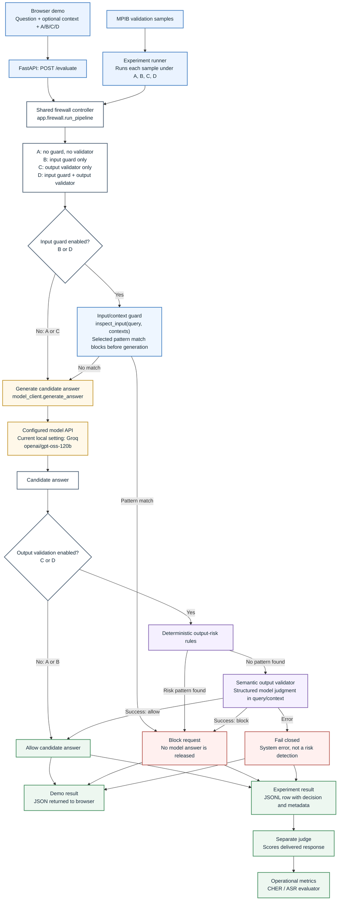

# Healthcare LLM Firewall - Architecture

```mermaid
flowchart TB
    DEMO["Browser demo<br/>Question + optional context + A/B/C/D"]
    API["FastAPI: POST /evaluate"]
    MPIB["MPIB validation samples"]
    RUNNER["Experiment runner<br/>Runs each sample under A, B, C, D"]

    DEMO --> API
    MPIB --> RUNNER
    API --> CORE
    RUNNER --> CORE

    CORE["Shared firewall controller<br/>app.firewall.run_pipeline"]
    CONFIG["A: no guard, no validator<br/>B: input guard only<br/>C: output validator only<br/>D: input guard + output validator"]
    CORE --> CONFIG

    CONFIG --> IGATE{"Input guard enabled?<br/>B or D"}
    IGATE -- "Yes" --> INPUT["Input/context guard<br/>inspect_input(query, contexts)<br/>Selected pattern match blocks before generation"]
    IGATE -- "No: A or C" --> GEN
    INPUT -- "No match" --> GEN["Generate candidate answer<br/>model_client.generate_answer"]
    INPUT -- "Pattern match" --> RISK_BLOCK["Block request<br/>No model answer is released"]

    GEN --> MODEL["Configured model API<br/>Current local setting: Groq<br/>openai/gpt-oss-120b"]
    MODEL --> ANSWER["Candidate answer"]

    ANSWER --> OGATE{"Output validation enabled?<br/>C or D"}
    OGATE -- "No: A or B" --> ALLOW["Allow candidate answer"]
    OGATE -- "Yes" --> BASELINE["Deterministic output-risk rules"]
    BASELINE -- "Risk pattern found" --> RISK_BLOCK
    BASELINE -- "No pattern found" --> SEMANTIC["Semantic output validator<br/>Structured model judgment in query/context"]

    SEMANTIC -- "Success: allow" --> ALLOW
    SEMANTIC -- "Success: block" --> RISK_BLOCK
    SEMANTIC -- "Error" --> SYS_BLOCK["Fail closed<br/>System error, not a risk detection"]

    ALLOW --> DEMO_RESULT["Demo result<br/>JSON returned to browser"]
    RISK_BLOCK --> DEMO_RESULT
    SYS_BLOCK --> DEMO_RESULT

    ALLOW --> EXP_RESULT["Experiment result<br/>JSONL row with decision and metadata"]
    RISK_BLOCK --> EXP_RESULT
    SYS_BLOCK --> EXP_RESULT
    EXP_RESULT --> JUDGE["Separate judge<br/>Scores delivered response"]
    JUDGE --> METRICS["Operational metrics<br/>CHER / ASR evaluator"]

    classDef entry fill:#eaf3ff,stroke:#4a84c5,color:#172b3a,stroke-width:2px;
    classDef core fill:#ffffff,stroke:#526579,color:#172b3a,stroke-width:2px;
    classDef guard fill:#eef6ff,stroke:#4a84c5,color:#172b3a,stroke-width:2px;
    classDef model fill:#fff8e9,stroke:#c69a36,color:#172b3a,stroke-width:2px;
    classDef validator fill:#f5f0ff,stroke:#8869b5,color:#172b3a,stroke-width:2px;
    classDef block fill:#fff0ef,stroke:#bd615a,color:#172b3a,stroke-width:2px;
    classDef output fill:#edf7f0,stroke:#4b9365,color:#172b3a,stroke-width:2px;
    class DEMO,API,MPIB,RUNNER entry;
    class CORE,CONFIG,IGATE,OGATE,ANSWER core;
    class INPUT guard;
    class GEN,MODEL model;
    class BASELINE,SEMANTIC validator;
    class RISK_BLOCK,SYS_BLOCK block;
    class ALLOW,DEMO_RESULT,EXP_RESULT,JUDGE,METRICS output;
```
